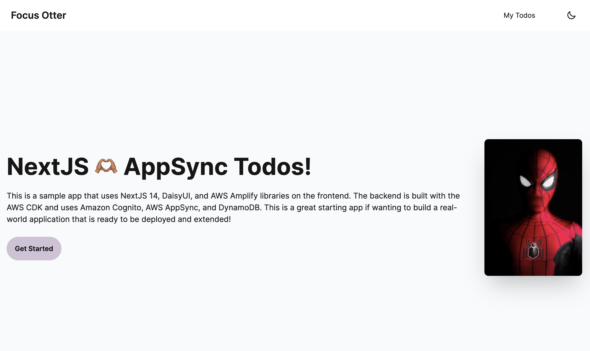
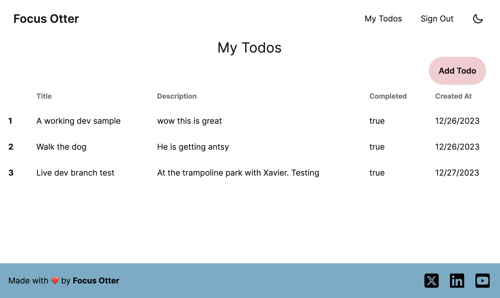
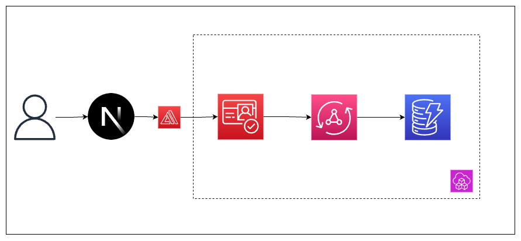

# Fullstack NextJS + AWS CDK Starter (ft. AWS AppSync and friends)



## Overview

As a Senior Developer Advocate, I create _a lot_ of sample repositories. Also, because I work at the API layer (AWS AppSync), I usually create a frontend that calls the API, and a backend that creates and configures it.

To scaffold out these projects, sometimes I use AWS Amplify's CLI, other times I may drop down a level and use the L3 CDK construct, and for the times when I want complete control, I use the L2 construct.

I have to make this decision so often, that I created a sample repo for each of those 3 scenarios.

**This repo is for when I need to create a fullstack application using NextJS 14, and create my entire backend using the AWS CDK L2 constructs**

## Tech Stack and Feature List

The AWS Amplify CLI comes with a lot of power and is a great place to start if wanting to build your next application. However, there are times when I have to do things the "Amplify way". As such, this repo aims to mimic much of the same functionality of Amplify while still offering full flexibility.

> **🚨This is not a framework, but simply a starter repo**

### The Frontend Stack



When I create my demos and sample apps, I have a limited time to create something compelling. Due to that, not every use case is covered and not every error is handled. However, I try to stick to a stack that allows me to teach a topic while still being visually and technically interesting.

The frontend stack is comprised of the following main pieces:

- **NextJS 14**: At the time of this commit, I'm still learning the basics of the app directory and RSC's in general. Primarily around cacheing.

- **Tailwind CSS**: I use this for the layout and for basic styling. I'm not very good at it, but with so many component libraries not offering much compatability with RSC's this is a great option.

- **DaisyUI**: This component library makes working with Tailwind much easier and time effective. Not only is this used for the visual appeal, but it's what I used to implement a **dark mode toggle**.

- **AWS Amplify JS libraries and Connected Components**: Connecting my frontend to my backend is done relatively simply through the use of Amplify's libraries. They've updated to `v6` recently to allow API's to be called on the client and server. I also use their `Authenticator` component to provide a simple and pre-built auth flow.

### The Backend Stack



The backend is made up of 2 pieces: What I use to create my backend services, and the services themselves.

- **AWS CDK**: This is used to create the backend services. This framework allows me to define my backend as _infrastructure-as-code_. The added benefit is that I can use TypeScript to provision those services.

- **AWS AppSync**: The team that I'm on 🥰. This uses a GraphQL model to connect to your datasources. The resolvers are written in TypeScript (transpiled to JavaScript) and allow a direct integration to both AWS services, and external API's without the need of an Lambda function. This also comes with websocket support out-of-the-box. The schema for this application models a todo app.

- **Amazon Cognito**: This is the authentication and authorization piece of the application. This service is made up of 3 core parts:

  1. **Userpool**: This defines how our users login/signup and as the name suggests, ends up containing all of our users.
  2. **Identity Pool**: If a userpool is used to authenticate, then an identity pool is used for authorization. This provides the `roles` (set of permissions) that our authenticated and unauthenticated users can do.
  3. **Web Client**: There are many ways to sign up. It could be a web app, an IoT device, a server, etc. This simply tells Cognito we are authenticating on the web.

- **Amazon DynamoDB**: This NoSQL database provides a flexible way of accessing and storing data. We have a single table in this application: a `Todo` table. However we created 2 ways to store data:
  1. **By `id`**: Every todo has a unique `id` field when created.
  2. **By `__typename` sorted by `owner`**: Every todo has a `Todo` field. When used with the `owner` field (Cogito user sub), we can say "Give me every todo that belongs to this user" efficiently and without doing a full scan + filter on the database.

### Deployment

One thing I really like about the AWS Amplify CLI model of doing things is how it creates a multi-branch workflow. So my `main` branch can belong to my `production` environment and my `dev` branch can be used for my `develop` environment. So every time I push code to GitHub, it uses AWS Amplify Hosting to automatically redeploy my code.

This is great, except for when I want to deploy my `develop` branch in an AWS account/region close to me, my `staging` branch in a different account/region close to my users, and a `production` branch somewhere else.

To solve that for that, I use a mix of the following:

- **CDK Context**: This JSON file contains all of my dynamic variables such as the app name, and account number of the account I want to deploy to.
- **Git Branch**: This simple NPM package is used locally for building and deploying changes. It matches the current git branch with the corresponding config object in the CDK Context file.
- **Amplify Hosting**: This alpha L2 construct uses the CDK Context file to find the account and region information to deploy our backend resources to. Because an Amplify Hosting environment doesn't use Git (it uses Code Deploy), there isn't a `git-branch` available. Instead is uses a `$AWS_BRANCH` variable.

The combination of these 3 pieces allow me to have a best-of-both-worlds setup where I can use the ease of Amplify Hosting with the flexibility of the CDK.

## Setup

As mentioned, this project is made for me 😅 But if can be made for you too!

There isn't much to change.

Let's assume you've forked and cloned the repo. You'll be on the `main` branch. From here do the following:

1. **Install the dependencies**

```sh
cd _backend && npm i && cd .. && npm i
```

2. **Update the `cdk.context.json` values**: Probably the most important step. These values need to correspond to your project details. Note that if you change the appName, you'll also want to change the `awsconfig.ts` frontend file to match as well. It follows an `${appName}-${stage}-Stack` convention. Also the value for `ghTokenName` is the name of the key stored in AWS Secrets Manager. If video is your thing, I have a  that covers most of this in a separate app!
3. Update deploy:local script in `_backend/package.json` as needed
4. Checkout to your `dev` branch.
5. Run the `deploy:local` script.
6. Push a commit to GitHub and check the build in the Amplify Hosting console.

> 🙏 Please file an issue or ping me on [social media](https://focusotter.com) if something needs to be better explained! My assumption is that if this repo is something that interests you, then a lot of this will makes sense but happy to clear things up!
